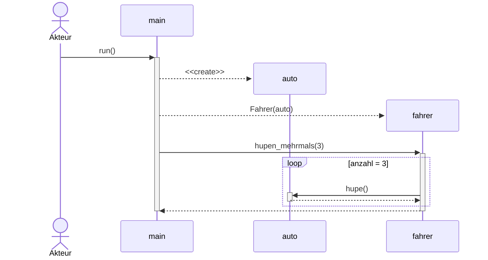
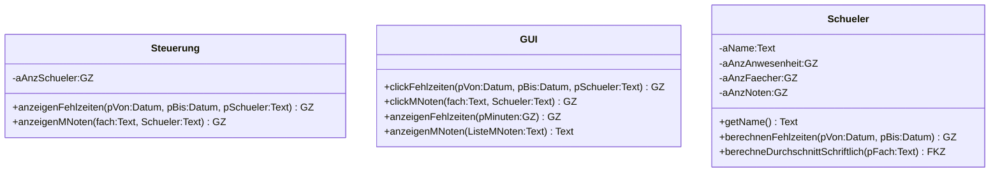

# Sequenzdiagramm
## 07b Aufgabe 1
### Zählschleife

```mermaid
sequenceDiagram

actor Akteur
    Akteur ->>+ main:run()

    create participant auto
    main -->> auto:<<create>>

    create participant fahrer
    main -->> fahrer:Fahrer(auto)
    main ->>+ fahrer:hupen_mehrmals(3)

    loop anzahl = 3
        fahrer ->>+ auto:hupe()
        deactivate auto
        auto -->> fahrer:    
    end

    fahrer -->>- main:
    deactivate main
   
```
### Break Schleife

### While Schleife

### Do-While Schleife

# Klassendiagramm

```mermaid
classDiagram

class Steuerung{
    -aAnzSchueler:GZ
    +anzeigenFehlzeiten(pVon:Datum, pBis:Datum, pSchueler:Text)GZ
    +anzeigenMNoten(fach:Text, Schueler:Text)GZ
}
class GUI{
    +clickFehlzeiten(pVon:Datum, pBis:Datum, pSchueler:Text)GZ
    +clickMNoten(fach:Text, Schueler:Text)GZ
    +anzeigenFehlzeiten(pMinuten:GZ)GZ
    +anzeigenMNoten(ListeMNoten:Text)Text
}
class Schueler{
    -aName:Text
    -aAnzAnwesenheit:GZ
    -aAnzFaecher:GZ
    -aAnzNoten:GZ
    +getName()Text
    +berechnenFehlzeiten(pVon:Datum, pBis:Datum)GZ
    +berechneDurchschnittSchriftlich(pFach:Text)FKZ
}
```