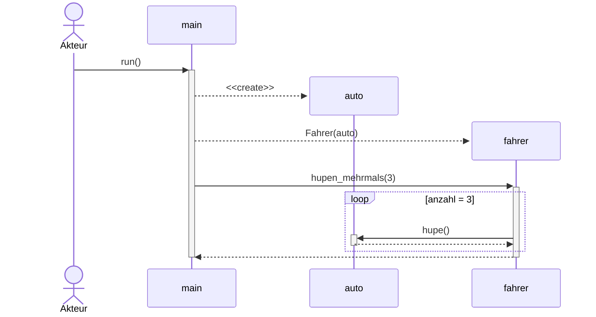

# Sequenzdiagramm
## 07b Aufgabe 1

```mermaid
sequenceDiagram

actor Akteur
    Akteur ->>+ main:run()

    create participant auto
    main -->> auto:<<create>>

    create participant fahrer
    main -->> fahrer:Fahrer(auto)
    main ->>+ fahrer:hupen_mehrmals(3)

    loop anzahl = 3
        fahrer ->>+ auto:hupe()
        deactivate auto
        auto -->> fahrer:    
    end

    fahrer -->>- main:
    deactivate main
   
```